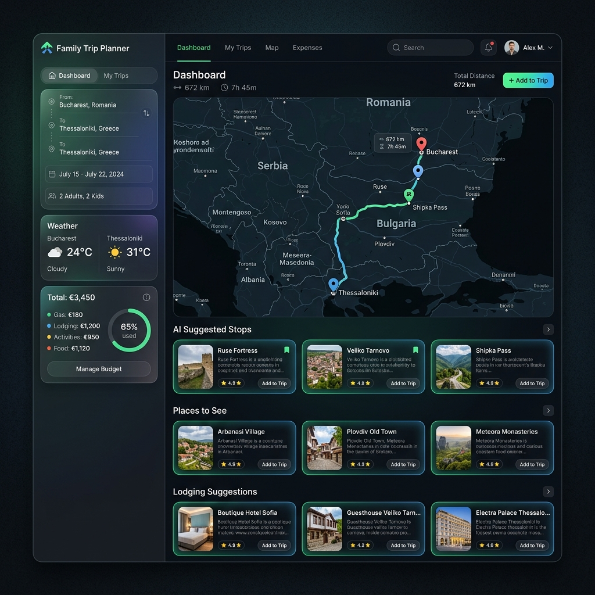

# Family Trip Planner

Proiect local și cloud pentru planificarea concediilor auto în familie, proiectat cu accent pe optimizarea bugetelor, itinerariilor, verificărilor logistice și asistenței AI.

---

## Prezentare Generală (Visual Tablou de Bord)

Interfața oferă un tablou de bord premium, complet echipat cu hărți interactive, widget-uri meteo live și carduri de recomandare generate dinamic:



---

## Ce Face Aplicația (Funcționalități Finalizate)

### 🗺️ Rutare Auto Live & Interactivă
- **OSRM Integration:** Calculează trasee auto reale cu timpi de condus, kilometri și geometrie detaliată.
- **Hartă OpenStreetMap (Leaflet):** Afișează linia traseului auto, segmentele de ferry (desenate distinct) și marcajele orașelor.
- **Introducere Trasee Libere:** Permite copierea și lipirea unui traseu întreg separat prin săgeți sau linii noi (ex. `București -> Craiova -> Drobeta-Turnu Severin`).
- **Catalog Offline Complect:** Geocodează instantaneu **27 de municipii reședință de județ din România** fără a interoga API-ul (eliminând latența și rate-limitingul).
- **Match-uri Inteligente:** Sistemul este dash-insensitive (ex: "drobeta turnu severin" cu spațiu recunoaște corect "Drobeta-Turnu Severin" cu cratimă).

### 💶 Calcul de Buget & Taxe pe Țări de Tranzit
- **Detectare Dinamică a Țărilor:** Țările tranzitate sunt calculate direct din coordonatele rutei auto în timp real, nu din rute fixe.
- **Tipuri de Combustibil:** Benzină, Diesel, GPL și Electric (calculează consumul în litri sau kWh).
- **Actualizare Online prețuri:** Conexiune la API-ul `/api/fuel-prices` pentru prețuri reale.
- **Taxe și Vignete:** Estimează automat costul de vignete (ex: RO, BG, HU, AT, SI, SK, CZ) sau cost per kilometru de autostradă (ex: IT, FR, GR, HR).

### 🤖 Sugestii AI Structurate și Dinamice
- **Generare Gemini:** Endpoint securizat `/api/ai-suggestions` (recomandat prin Lambda pe AWS) care generează recomandări complete.
- **Panouri Dinamice Populate Automat:** Asistentul AI returnează acum un bloc JSON structurat care populează automat secțiunile de jos:
  - **Opriri pe traseu:** Locuri de pauză (km, utilitate pentru copii, parcuri).
  - **Atracții turistice:** Locuri emblematice de văzut pe parcurs.
  - **Cazări candidate:** Opțiuni de sejur potrivite pentru bugetul tău.
- Caching automat pentru sugestii AI pe scenariu pentru a nu repeta apelurile API inutil.

### 💾 Scenarii Salvate (Manager Scenarii)
- Permite salvarea configurărilor de drum (orașe, mașină, bugete, check-in) sub un nume ales de tine direct în browser.
- Poți comuta instant între scenarii sau le poți șterge din listă.

### 📋 Checklist Dinamic & Vreme Live
- **Pregătiri de Drum:** Generează sarcini specifice pe baza profilului tău (vignete de cumpărat pe țări, verificări de pașaport/carte verde non-UE, bagaje copii, inspecție mașină).
- **Vreme Live la Destinație:** Afișează temperatura și cerul la destinație utilizând API-ul public gratuit Open-Meteo.

### 🖨️ Export PDF & Print
- Buton de printare care exportă fișa tehnică de călătorie: rezumatul costurilor, itinerariul, checklist-ul dinamic de drum și cazările sugerate, optimizat pe o pagină de imprimat sau salvat ca PDF.

---

## Structura Proiectului

- `index.html` - Structura principală a aplicației (Premium Dark/Light theme).
- `styles.css` - Design modern responsive, variabile CSS, carduri premium.
- `app.js` - Logica aplicației, caching, API calls și Leaflet.
- `docs/` - Documentații detaliate și screenshot-uri.
- `aws/` - Resurse pentru CloudFormation și codul Lambda Node.js pentru proxy-ul API de deploy cloud.

---

## Cum se Rulează Local

Deoarece folosește module standard și assets, pur și simplu servește folderul root cu orice server web static. De exemplu:

```bash
# Folosind npm (dacă ai Node.js)
npm run dev

# Sau folosind Python direct în folder
python -m http.server 8000
```
Deschide apoi `http://localhost:5173/` sau `http://localhost:8000/`.

---

## Configurare Deploy Cloud (AWS)

1. Găzduiește frontend-ul prin **AWS Amplify**.
2. Desfășoară backend-ul serverless folosind fișierul CloudFormation aflat în `aws/cloudformation-ai-proxy.yaml` (creează API Gateway-ul, endpoint-urile `/api/ai-suggestions` și `/api/fuel-prices`, Lambda-ul aferent și încarcă cheile API securizat).
3. Detalii complete se găsesc în [aws/README.md](aws/README.md).
